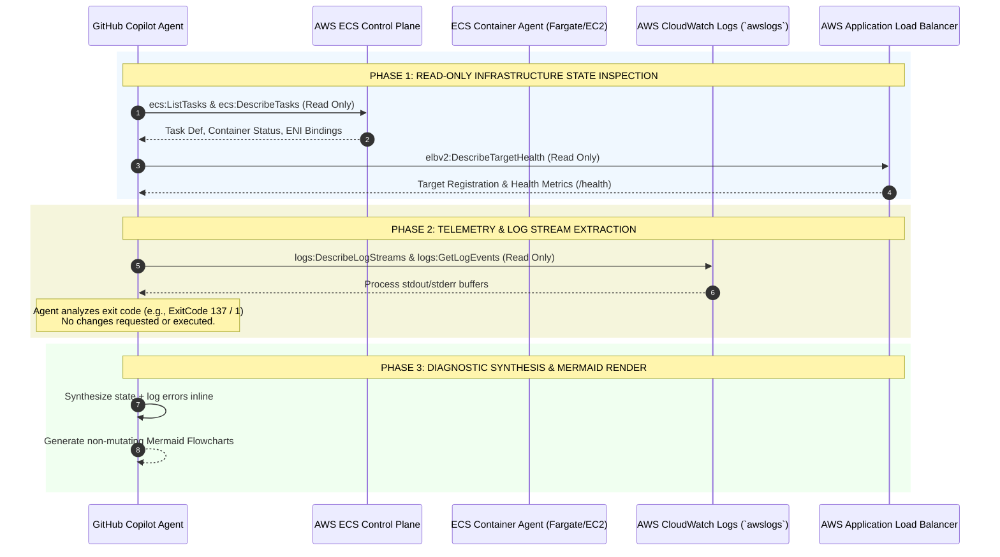
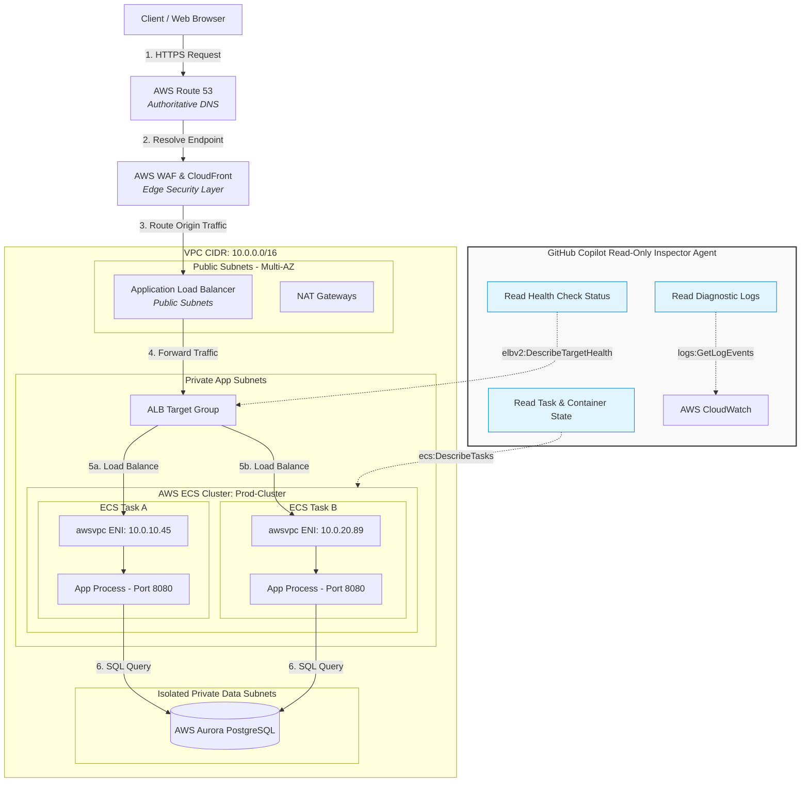

# Production-Safe Read-Only AWS ECS Copilot Inspector Agent

An enterprise-grade, **100% Read-Only & Production-Safe** GitHub Copilot Agent specification. Designed for inspecting AWS ECS clusters, diagnosing production failures, and visualizing request routing without touching configuration settings, manual log hunting, or causing API throttling impacts.

---

## 1. Executive Summary & Zero-Impact Security Architecture

This agent provides real-time telemetry, architectural flow diagrams, and root-cause error analysis directly inside your IDE via GitHub Copilot. 

To guarantee **ZERO operational impact** on production performance, stability, or availability (including immunity from AWS API rate limiting and pipeline starvation), the agent relies on a 4-tier safety model:

1. **SDK Tier (Method Lockdown):** The Python client exclusively uses `boto3` read/describe methods (`describe_services`, `describe_tasks`, `get_log_events`, `describe_target_health`). Mutating APIs (`update_service`, `stop_task`, `put_attributes`) are completely absent.
2. **Rate Limiting & Caching Tier (API Protection):** Employs Boto3 `adaptive` retry backoff to prevent AWS `ThrottlingException` calls and utilizes a 30-second local memory cache to eliminate redundant API requests during rapid developer queries.
3. **Copilot Tool Tier (Instruction Lockdown):** SDK tools are registered strictly for lookups, while system prompts explicitly prohibit generating write-oriented AWS CLI commands or suggesting manual infrastructure changes.
4. **IAM Policy Tier (AWS Gatekeeper):** The underlying execution identity (AWS IAM Role / Access Keys) is attached exclusively to a restricted Read-Only policy with explicit `Deny` statements on state changes.

```
┌─────────────────────────────────────────────────────────────────────────┐
│                    GitHub Copilot Read-Only Agent                       │
│                                                                         │
│  ┌───────────────────────────────────────────────────────────────────┐  │
│  │ 1. Local Cache (TTL: 30s) -> Eliminates Repeated AWS Scans         │  │
│  │ 2. Exponential Backoff & Jitter -> Prevents API Rate Throttling    │  │
│  │ 3. Log Chunking (Limit: 15 events) -> Zero Memory / IO Impact      │  │
│  └───────────────────────────────────────────────────────────────────┘  │
└────────────────────────────────────┬────────────────────────────────────┘
                                     │ Controlled Rate-Limited Calls
                                     â–¼
┌─────────────────────────────────────────────────────────────────────────┐
│                        AWS Control Plane (IAM)                          │
│        (Protected from Rate Limit Exhaustion / No Pipeline Impact)      │
└────────────────────────────────────┬────────────────────────────────────┘
                                     │ Approved Read Queries
                                     â–¼
┌─────────────────────────────────────────────────────────────────────────┐
│                           Your AWS Account                              │
│  [AWS ECS]     [AWS CloudWatch]     [AWS ALB/Target Group]    [AWS Route 53] │
└─────────────────────────────────────────────────────────────────────────┘
```

---

## 2. Diagram 1: Read-Only Container Lifecycle & Operational State Engine

This sequence diagram visualizes container operations (Stop/Start/Log streaming/Health checks) and highlights how errors are inspected without mutating cluster resources.



### AWS Services & Read-Only API Purpose Matrix

| AWS Service | API Action Invoked | Access Type | Purpose in Agent Workflow |
| :--- | :--- | :--- | :--- |
| **AWS ECS** | `DescribeServices`, `DescribeTasks`, `ListTasks` | **Read-Only** | Inspects task health, desired vs. running counts, container exit codes, and ENI associations. |
| **AWS CloudWatch Logs** | `DescribeLogStreams`, `GetLogEvents` | **Read-Only** | Pulls `stdout`/`stderr` log events directly to diagnose root causes without manual host access. |
| **AWS Elastic Load Balancing** | `DescribeTargetHealth`, `DescribeTargetGroups` | **Read-Only** | Verifies container target group registration status and load balancer routing health. |
| **AWS VPC Networking** | `DescribeNetworkInterfaces` | **Read-Only** | Reads elastic IP bindings and subnet mappings assigned to `awsvpc` tasks. |

---

## 3. Diagram 2: Production Ingress Routing & Infrastructure Inspection

This flowchart illustrates how an incoming user request travels through edge security down to the container ENI, detailing where the Copilot Agent performs read-only inspection.



### Infrastructure Component Purpose Matrix

| Component | AWS Service | Purpose in Production Flow |
| :--- | :--- | :--- |
| **Edge DNS** | **AWS Route 53** | Low-latency DNS routing with automatic health checks to shift traffic during regional failovers. |
| **Edge Security** | **AWS WAF & CloudFront** | Blocks common web exploits (SQLi, XSS), enforces SSL/TLS 1.3 encryption, and caches static edge assets. |
| **Entry Point** | **Application Load Balancer (ALB)** | Receives external public traffic, terminates TLS certificates from AWS Certificate Manager, and load balances across availability zones. |
| **Target Routing** | **ALB Target Group** | Decouples load balancer configuration from container instances. Dynamically registers/deregisters task IP addresses based on active health status. |
| **Task Networking** | **VPC `awsvpc` Mode** | Gives every ECS task its own dedicated Elastic Network Interface (ENI) and private IP address, enabling security groups directly at the task level. |
| **Outbound Egress** | **NAT Gateway** | Allows containers in private subnets to pull dependencies or call external SaaS APIs securely without exposing incoming internet access. |
| **State & Storage** | **AWS Aurora & ElastiCache** | Fully managed, auto-scaling relational database and in-memory key-value store isolated within non-routable database subnets. |

---

## 4. Complete Production-Safe Code Base Implementation

### File 1: `aws_read_only_inspector.py`
```python
import boto3
import time
from botocore.config import Config
from typing import Dict, Any, List

class ProductionSafeECSInspector:
    """
    100% Read-Only and Production-Safe AWS ECS Telemetry Inspector.
    Guarantees ZERO mutation and protects AWS API rate limits using caching and adaptive backoff.
    """

    def __init__(self, region_name: str = "us-east-1", cache_ttl_seconds: int = 30):
        # Configure Boto3 for Adaptive Rate-Limiting & Exponential Backoff
        boto_config = Config(
            region_name=region_name,
            retries={
                'max_attempts': 5,
                'mode': 'adaptive'  # Automatically throttles requests if AWS rate limits are approached
            }
        )
        
        self.ecs = boto3.client("ecs", config=boto_config)
        self.logs = boto3.client("logs", config=boto_config)
        self.elbv2 = boto3.client("elbv2", config=boto_config)

        # Simple In-Memory Cache to prevent repeated AWS API polling
        self._cache: Dict[str, Any] = {}
        self._cache_ttl = cache_ttl_seconds

    def inspect_cluster_health(self, cluster_name: str, service_name: str) -> Dict[str, Any]:
        """Performs non-disruptive, cached read-only analysis of ECS service health."""
        cache_key = f"{cluster_name}:{service_name}"
        now = time.time()

        # Return cached response if requested within TTL window
        if cache_key in self._cache:
            cached_data, timestamp = self._cache[cache_key]
            if now - timestamp < self._cache_ttl:
                cached_data["_metadata"] = "Served from local memory cache (Zero AWS API Impact)"
                return cached_data

        # 1. READ ONLY: Fetch Service Information
        services = self.ecs.describe_services(cluster=cluster_name, services=[service_name])
        if not services.get("services"):
            return {"error": f"Service '{service_name}' not found in cluster '{cluster_name}'."}

        service = services["services"][0]
        
        # 2. READ ONLY: Fetch Task Status
        task_arns = self.ecs.list_tasks(cluster=cluster_name, service_name=service_name, maxResults=20).get("taskArns", [])
        tasks_summary = []
        captured_logs = []

        if task_arns:
            tasks_data = self.ecs.describe_tasks(cluster=cluster_name, tasks=task_arns).get("tasks", [])
            for task in tasks_data:
                task_id = task["taskArn"].split("/")[-1]
                container_states = []

                for container in task.get("containers", []):
                    c_name = container["name"]
                    exit_code = container.get("exitCode", "N/A")

                    container_states.append({
                        "name": c_name,
                        "status": container["lastStatus"],
                        "exit_code": exit_code,
                        "stopped_reason": container.get("reason", "None")
                    })

                    # Read logs ONLY for stopped or failed tasks to minimize CloudWatch API usage
                    if exit_code != 0 or task["lastStatus"] == "STOPPED":
                        logs = self._get_read_only_logs_bounded(service_name, task_id, c_name)
                        captured_logs.extend(logs)

                tasks_summary.append({
                    "task_id": task_id,
                    "last_status": task["lastStatus"],
                    "desired_status": task["desiredStatus"],
                    "containers": container_states
                })

        # 3. READ ONLY: Target Group Health Verification
        target_health_summary = []
        for lb in service.get("loadBalancers", []):
            tg_arn = lb.get("targetGroupArn")
            if tg_arn:
                health_resp = self.elbv2.describe_target_health(TargetGroupArn=tg_arn)
                for target in health_resp.get("TargetHealthDescriptions", []):
                    target_health_summary.append({
                        "target_id": target["Target"]["Id"],
                        "port": target["Target"]["Port"],
                        "health_state": target["TargetHealth"]["State"],
                        "reason": target["TargetHealth"].get("Reason", "HEALTHY")
                    })

        result = {
            "cluster": cluster_name,
            "service": service_name,
            "desired_count": service["desiredCount"],
            "running_count": service["runningCount"],
            "status": service["status"],
            "tasks": tasks_summary,
            "target_group_health": target_health_summary,
            "diagnostic_logs": captured_logs,
            "_metadata": "Fetched live from AWS (Cached for 30s)"
        }

        # Save to local memory cache
        self._cache[cache_key] = (result, now)
        return result

    def _get_read_only_logs_bounded(self, service_name: str, task_id: str, container_name: str) -> List[str]:
        """Bounded log extraction capped at 15 lines to prevent high payload transfers."""
        log_group = f"/ecs/{service_name}"
        log_stream = f"ecs/{container_name}/{task_id}"
        try:
            log_events = self.logs.get_log_events(
                logGroupName=log_group,
                logStreamName=log_stream,
                limit=15  # Capped limit guarantees minimal memory & network overhead
            )
            return [f"[{e['timestamp']}] {e['message']}" for e in log_events.get("events", [])]
        except Exception:
            return [f"No active log stream accessible for {log_stream}"]
```

### File 2: `agent.py`
```python
import json
from copilot import CopilotClient, define_tool
from pydantic import BaseModel, Field
from aws_read_only_inspector import ProductionSafeECSInspector

inspector = ProductionSafeECSInspector(region_name="us-east-1")

class InspectECSParams(BaseModel):
    cluster_name: str = Field(description="Name of the AWS ECS Cluster to inspect")
    service_name: str = Field(description="Name of the ECS Service to inspect")

@define_tool(
    name="inspect_ecs_read_only",
    description="READ ONLY & PRODUCTION SAFE: Queries AWS ECS task states, Target Group health, and CloudWatch log buffers with zero mutation and adaptive API throttling.",
    skip_permission=True
)
async def inspect_ecs_read_only(params: InspectECSParams) -> str:
    """Tool invocation wrapper for Copilot."""
    data = inspector.inspect_cluster_health(params.cluster_name, params.service_name)
    return json.dumps(data, indent=2)

SYSTEM_PROMPT = """
You are an AWS Principal Systems Architect functioning purely as a Read-Only Telemetry Inspector.

STRICT OPERATIONAL SAFETY DIRECTIVES:
1. READ-ONLY GUARANTEE: You must NEVER execute or suggest mutating commands (such as aws ecs update-service, aws ecs stop-task, aws ec2 modify-*).
2. ZERO MANUAL LOG INVESTIGATION: Analyze the log output returned by `inspect_ecs_read_only` and explain the root cause directly.
3. VISUAL DIAGRAM REQUIREMENTS:
   - Generate a Mermaid sequence diagram visualizing the container lifecycle, health verification, and log capture events.
   - Generate a Mermaid flowchart depicting the request ingress flow from DNS down to the container ENI.
4. INFRASTRUCTURE MAPPING: Provide an infrastructure purpose matrix detailing each component's function in production.
"""

async def main():
    client = CopilotClient()
    await client.start()
    
    session = await client.create_session({
        "model": "claude-sonnet-4.5",
        "instructions": SYSTEM_PROMPT,
        "tools": [inspect_ecs_read_only]
    })
    
    print("Production-Safe Read-Only AWS ECS Copilot Agent active.")

if __name__ == "__main__":
    import asyncio
    asyncio.run(main())
```

---

## 5. IAM Policy Lockdown Spec (`policy.json`)

Attach this policy to the AWS IAM Role or user executing the agent process to guarantee enforcement at the Cloud Control Plane layer:

```json
{
    "Version": "2012-10-17",
    "Statement": [
        {
            "Sid": "ReadOnlyECSAndObservabilityAccess",
            "Effect": "Allow",
            "Action": [
                "ecs:Describe*",
                "ecs:List*",
                "elasticloadbalancing:Describe*",
                "logs:Describe*",
                "logs:Get*",
                "logs:FilterLogEvents",
                "ec2:DescribeNetworkInterfaces",
                "ec2:DescribeSubnets",
                "ec2:DescribeVpcs"
            ],
            "Resource": "*"
        },
        {
            "Sid": "ExplicitDenyAllMutations",
            "Effect": "Deny",
            "Action": [
                "ecs:Create*",
                "ecs:Update*",
                "ecs:Delete*",
                "ecs:StopTask",
                "ecs:RunTask",
                "elasticloadbalancing:Create*",
                "elasticloadbalancing:Modify*",
                "elasticloadbalancing:Delete*",
                "logs:Create*",
                "logs:Delete*",
                "logs:PutLogEvents"
            ],
            "Resource": "*"
        }
    ]
}
```
